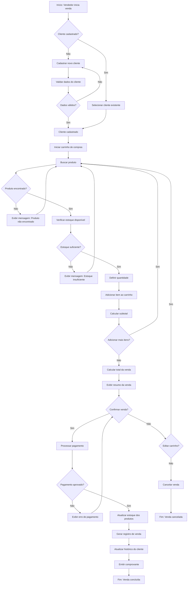
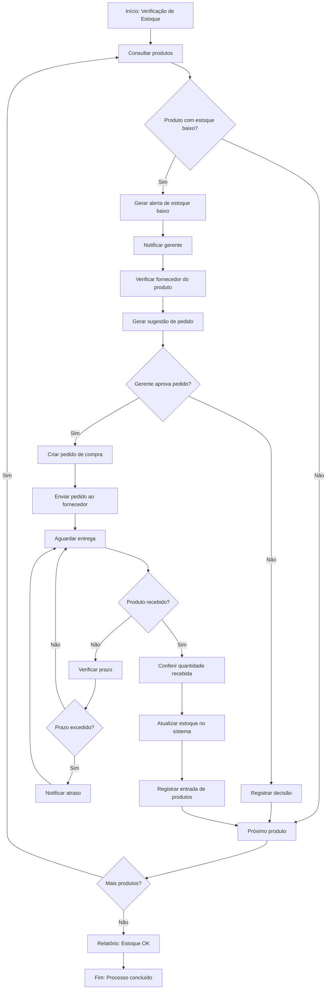
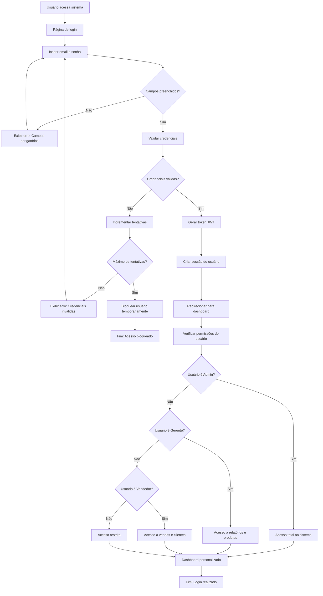

# 📐 DIAGRAMAS UML - SISTEMA COMERCIAL PEREIRA

## 1. 🎭 DIAGRAMA DE CASOS DE USO

### Visão Geral dos Atores e Sistema

```
                    SISTEMA DE GESTÃO COMERCIAL PEREIRA
                              
    👤 Administrador                                      👤 Vendedor
         │                                                    │
    ┌────┴────┐                                         ┌────┴────┐
    │         │                                         │         │
    │ UC01    │      ┌─────────────────────────────────────────┐  │ UC06    │
    │Gerenciar│◄────►│                                         │  │Processar│
    │Usuários │      │           CASOS DE USO PRINCIPAIS       │  │Vendas   │
    └─────────┘      │                                         │  └─────────┘
                     │  UC01 - Gerenciar Usuários             │         │
    ┌─────────┐      │  UC02 - Gerenciar Produtos             │  ┌─────────┐
    │ UC02    │◄────►│  UC03 - Gerenciar Categorias           │  │ UC07    │
    │Gerenciar│      │  UC04 - Gerenciar Clientes             │  │Consultar│
    │Produtos │      │  UC05 - Controlar Estoque              │  │Estoque  │
    └─────────┘      │  UC06 - Processar Vendas               │  └─────────┘
                     │  UC07 - Consultar Estoque              │         │
    ┌─────────┐      │  UC08 - Gerar Relatórios               │  ┌─────────┐
    │ UC03    │◄────►│  UC09 - Visualizar Dashboard           │  │ UC04    │
    │Gerenciar│      │  UC10 - Autenticar Usuário             │  │Gerenciar│
    │Categorias│     │  UC11 - Gerenciar Fornecedores         │  │Clientes │
    └─────────┘      │  UC12 - Configurar Sistema             │  └─────────┘
         │           │                                         │         │
    ┌────┴────┐      └─────────────────────────────────────────┘  ┌─────────┐
    │ UC12    │                           │                        │ UC08    │
    │Configurar│                     ┌────┴────┐                   │Gerar    │
    │Sistema  │                     │ UC10    │                   │Relatórios│
    └─────────┘                     │Autenticar│                  └─────────┘
                                    │Usuário  │                          │
                                    └─────────┘                   ┌─────────┐
                                         │                        │ UC09    │
                                    👤 Sistema                    │Visualizar│
                                    (Autenticação)               │Dashboard│
                                                                 └─────────┘
                                                                      │
                                                               👤 Gerente
```

### Especificação Detalhada dos Casos de Uso

#### **UC01 - Gerenciar Usuários**
- **Ator Principal:** Administrador
- **Descrição:** Cadastrar, editar, excluir e listar usuários do sistema
- **Pré-condições:** Usuário logado com perfil de Administrador
- **Fluxo Principal:**
  1. Administrador acessa módulo de usuários
  2. Seleciona ação (criar, editar, excluir, listar)
  3. Preenche/modifica dados (nome, email, perfil, senha)
  4. Sistema valida informações
  5. Sistema confirma operação
- **Pós-condições:** Usuário criado/modificado/removido no sistema

#### **UC02 - Gerenciar Produtos**
- **Ator Principal:** Administrador, Gerente
- **Descrição:** Manter catálogo de produtos da Comercial Pereira
- **Categorias Específicas:** 
  - Equipamentos Domésticos
  - Embalagens
  - Cosméticos e Higiene
  - Cama, Mesa e Banho
  - Papelaria
  - Ferragens
  - Material Elétrico
  - Armarinho
- **Fluxo Principal:**
  1. Usuário acessa módulo de produtos
  2. Seleciona categoria específica
  3. Define dados (nome, código, preço, descrição)
  4. Configura estoque inicial e mínimo
  5. Sistema valida código único
  6. Sistema registra produto

#### **UC06 - Processar Vendas**
- **Ator Principal:** Vendedor
- **Descrição:** Realizar vendas atacadistas e varejistas
- **Fluxo Principal:**
  1. Vendedor inicia nova venda
  2. Seleciona/cadastra cliente
  3. Adiciona produtos ao carrinho
  4. Sistema calcula totais automaticamente
  5. Confirma venda
  6. Sistema atualiza estoque
  7. Gera registro da transação

#### **UC08 - Gerar Relatórios**
- **Ator Principal:** Gerente
- **Tipos de Relatórios:**
  - Vendas por período
  - Produtos mais vendidos
  - Análise de categorias
  - Performance de vendedores
  - Estoque baixo
  - Clientes mais ativos

## 2. 🏗️ DIAGRAMA DE CLASSES

### Visão Completa das Classes do Sistema

```typescript
┌─────────────────────────────────────────────────────────────────┐
│                           USER                                  │
├─────────────────────────────────────────────────────────────────┤
│ - id: number                                                    │
│ - email: string                                                 │
│ - password: string                                              │
│ - name: string                                                  │
│ - role: UserRole                                                │
│ - createdAt: Date                                               │
│ - updatedAt: Date                                               │
├─────────────────────────────────────────────────────────────────┤
│ + authenticate(email: string, password: string): boolean        │
│ + hasPermission(action: string): boolean                        │
│ + updateProfile(data: UserUpdateData): void                     │
│ + changePassword(newPassword: string): void                     │
└─────────────────────────────────────────────────────────────────┘
                                │
                                │ 1:N
                                ▼
┌─────────────────────────────────────────────────────────────────┐
│                           SALE                                  │
├─────────────────────────────────────────────────────────────────┤
│ - id: number                                                    │
│ - userId: number                                                │
│ - customerId: number                                            │
│ - total: decimal                                                │
│ - status: SaleStatus                                            │
│ - createdAt: Date                                               │
│ - updatedAt: Date                                               │
├─────────────────────────────────────────────────────────────────┤
│ + calculateTotal(): decimal                                     │
│ + addItem(product: Product, quantity: number): void             │
│ + removeItem(productId: number): void                           │
│ + updateStatus(status: SaleStatus): void                        │
│ + generateInvoice(): Invoice                                    │
└─────────────────────────────────────────────────────────────────┘
       │                                              │
       │ 1:N                                          │ N:1
       ▼                                              ▼
┌─────────────────────────┐                ┌─────────────────────────┐
│      SALE_ITEM          │                │       CUSTOMER          │
├─────────────────────────┤                ├─────────────────────────┤
│ - id: number            │                │ - id: number            │
│ - saleId: number        │                │ - name: string          │
│ - productId: number     │                │ - email: string         │
│ - quantity: number      │                │ - phone: string         │
│ - price: decimal        │                │ - address: string       │
│ - total: decimal        │                │ - document: string      │
├─────────────────────────┤                │ - customerType: enum    │
│ + calculateSubtotal()   │                │ - createdAt: Date       │
└─────────────────────────┘                ├─────────────────────────┤
       │                                   │ + getFullAddress()      │
       │ N:1                               │ + getPurchaseHistory()  │
       ▼                                   │ + isVIP(): boolean      │
┌─────────────────────────────────────────┐└─────────────────────────┘
│             PRODUCT                     │
├─────────────────────────────────────────┤
│ - id: number                            │
│ - name: string                          │
│ - description: string                   │
│ - price: decimal                        │
│ - code: string                          │
│ - categoryId: number                    │
│ - supplierId: number                    │
│ - createdAt: Date                       │
│ - updatedAt: Date                       │
├─────────────────────────────────────────┤
│ + updatePrice(newPrice: decimal): void  │
│ + checkAvailability(): boolean          │
│ + getStockLevel(): number               │
│ + isLowStock(): boolean                 │
└─────────────────────────────────────────┘
       │                           │
       │ N:1                       │ 1:1
       ▼                           ▼
┌─────────────────────────┐ ┌─────────────────────────┐
│       CATEGORY          │ │      INVENTORY          │
├─────────────────────────┤ ├─────────────────────────┤
│ - id: number            │ │ - id: number            │
│ - name: string          │ │ - productId: number     │
│ - description: string   │ │ - quantity: number      │
│ - isActive: boolean     │ │ - minStock: number      │
├─────────────────────────┤ │ - lastUpdated: Date     │
│ + getProducts()         │ ├─────────────────────────┤
│ + getProductCount()     │ │ + updateQuantity(qty)   │
└─────────────────────────┘ │ + isLowStock(): boolean │
                            │ + addStock(quantity)    │
                            │ + removeStock(quantity) │
                            └─────────────────────────┘

┌─────────────────────────────────────────────────────────────────┐
│                        SUPPLIER                                 │
├─────────────────────────────────────────────────────────────────┤
│ - id: number                                                    │
│ - name: string                                                  │
│ - contactPerson: string                                         │
│ - email: string                                                 │
│ - phone: string                                                 │
│ - address: string                                               │
│ - cnpj: string                                                  │
│ - isActive: boolean                                             │
├─────────────────────────────────────────────────────────────────┤
│ + getProducts(): Product[]                                      │
│ + updateContactInfo(info: ContactInfo): void                    │
│ + getOrderHistory(): Order[]                                    │
└─────────────────────────────────────────────────────────────────┘
```

### Enumerações e Tipos

```typescript
enum UserRole {
  ADMIN = "ADMIN",
  MANAGER = "MANAGER", 
  SALESPERSON = "SALESPERSON"
}

enum SaleStatus {
  PENDING = "PENDING",
  COMPLETED = "COMPLETED", 
  CANCELLED = "CANCELLED",
  REFUNDED = "REFUNDED"
}

enum CustomerType {
  RETAIL = "RETAIL",      // Varejo
  WHOLESALE = "WHOLESALE"  // Atacado
}

enum CategoryType {
  DOMESTIC_EQUIPMENT = "DOMESTIC_EQUIPMENT",    // Equipamentos Domésticos
  PACKAGING = "PACKAGING",                      // Embalagens  
  COSMETICS = "COSMETICS",                      // Cosméticos
  HOME_TEXTILES = "HOME_TEXTILES",              // Cama, Mesa e Banho
  STATIONERY = "STATIONERY",                    // Papelaria
  HARDWARE = "HARDWARE",                        // Ferragens
  ELECTRICAL = "ELECTRICAL",                    // Material Elétrico
  HABERDASHERY = "HABERDASHERY"                // Armarinho
}
```

## 3. ⚡ DIAGRAMA DE ATIVIDADES

### Fluxo Principal: Processamento de Venda



### Fluxo: Gestão de Estoque



### Fluxo: Autenticação e Autorização



## 4. 🗄️ MODELO ENTIDADE-RELACIONAMENTO (MER)

### Modelo Conceitual Detalhado

```
                    COMERCIAL PEREIRA - MODELO ENTIDADE-RELACIONAMENTO
    
    ┌─────────────┐         ┌──────────────┐         ┌─────────────┐
    │    USER     │         │   CATEGORY   │         │  SUPPLIER   │
    │             │         │              │         │             │
    │ PK id       │         │ PK id        │         │ PK id       │
    │    email    │         │    name      │         │    name     │
    │    password │         │    description│        │    contact  │
    │    name     │         │    isActive  │         │    email    │
    │    role     │         │    createdAt │         │    phone    │
    │    createdAt│         └──────────────┘         │    address  │
    │    updatedAt│                │                  │    cnpj     │
    └─────────────┘                │ 1                │    isActive │
           │                       │                  └─────────────┘
           │ 1                     │                         │ 1
           │                       │                         │
           │ realiza               │ categoriza              │ fornece
           │                       │                         │
           ▼ N                     ▼ N                      ▼ N
    ┌─────────────┐         ┌──────────────┐         ┌─────────────┐
    │    SALE     │         │   PRODUCT    │◄────────┤             │
    │             │         │              │ N       │             │
    │ PK id       │    ┌───►│ PK id        │         │             │
    │ FK userId   │    │    │    name      │         │             │
    │ FK customerId│   │    │    description│        │             │
    │    total    │    │    │    price     │         │             │
    │    status   │    │    │    code      │         │             │
    │    createdAt│    │    │ FK categoryId│         │             │
    │    updatedAt│    │    │ FK supplierId│         │             │
    └─────────────┘    │    │    createdAt │         │             │
           │           │    │    updatedAt │         │             │
           │ 1         │    └──────────────┘         │             │
           │           │           │ 1               │             │
           │ contém    │           │ possui          │             │
           │           │           │                 │             │
           ▼ N        │           ▼ 1               │             │
    ┌─────────────┐    │    ┌──────────────┐         │             │
    │ SALE_ITEM   │────┘    │  INVENTORY   │         │             │
    │             │         │              │         │             │
    │ PK id       │ N       │ PK id        │         │             │
    │ FK saleId   │────────►│ FK productId │         │             │
    │ FK productId│         │    quantity  │         │             │
    │    quantity │         │    minStock  │         │             │
    │    price    │         │    lastUpdate│         │             │
    │    total    │         └──────────────┘         │             │
    └─────────────┘                                  │             │
           ▲                                         │             │
           │ N                                       │             │
           │ compra                                  │             │
           │                                         │             │
           │ 1                                       │             │
    ┌─────────────┐                                  │             │
    │  CUSTOMER   │                                  │             │
    │             │                                  │             │
    │ PK id       │                                  │             │
    │    name     │                                  │             │
    │    email    │                                  │             │
    │    phone    │                                  │             │
    │    address  │                                  │             │
    │    document │                                  │             │
    │    type     │                                  │             │
    │    createdAt│                                  │             │
    └─────────────┘                                  │             │
```

### Especificação das Entidades

#### **USER (Usuário)**
- **Descrição:** Funcionários que operam o sistema
- **Atributos:**
  - `id` (PK): Identificador único
  - `email` (UNIQUE): Email para login
  - `password`: Senha hasheada (bcrypt)
  - `name`: Nome completo
  - `role`: Perfil (ADMIN, MANAGER, SALESPERSON)
  - `createdAt`, `updatedAt`: Controle temporal

#### **PRODUCT (Produto)**
- **Descrição:** Produtos comercializados pela empresa
- **Atributos:**
  - `id` (PK): Identificador único
  - `name`: Nome do produto
  - `description`: Descrição detalhada
  - `price`: Preço unitário (DECIMAL 10,2)
  - `code` (UNIQUE): Código interno único
  - `categoryId` (FK): Referência à categoria
  - `supplierId` (FK): Referência ao fornecedor
- **Regras de Negócio:**
  - Código deve ser único no sistema
  - Preço deve ser maior que zero
  - Produto deve ter categoria obrigatória

#### **CATEGORY (Categoria)**
- **Descrição:** Categorias baseadas nos CNAEs da empresa
- **Categorias Específicas:**
  1. Equipamentos Domésticos (CNAE: 46.49-4-99)
  2. Embalagens (CNAE: 46.86-9-02)
  3. Cosméticos e Higiene (CNAE: 47.72-5-00)
  4. Cama, Mesa e Banho (CNAE: 46.41-9-02)
  5. Papelaria (CNAE: 46.47-8-01)
  6. Ferragens (CNAE: 46.72-9-00)
  7. Material Elétrico (CNAE: 46.73-7-00)
  8. Armarinho (CNAE: 46.41-9-03)

#### **SALE (Venda)**
- **Descrição:** Transações de vendas atacadistas e varejistas
- **Atributos:**
  - `total`: Valor total calculado automaticamente
  - `status`: Status da venda (PENDING, COMPLETED, CANCELLED)
- **Regras de Negócio:**
  - Uma venda deve ter ao menos um item
  - Total é calculado automaticamente
  - Estoque é atualizado após confirmação

#### **INVENTORY (Estoque)**
- **Descrição:** Controle de estoque por produto
- **Atributos:**
  - `quantity`: Quantidade atual em estoque
  - `minStock`: Quantidade mínima (alerta)
  - `lastUpdate`: Última atualização
- **Regras de Negócio:**
  - Quantidade não pode ser negativa
  - Alerta quando quantity ≤ minStock
  - Atualização automática nas vendas

### Relacionamentos Detalhados

#### **USER → SALE (1:N)**
- Um usuário pode realizar múltiplas vendas
- Toda venda deve ter um usuário responsável
- Permite rastreamento de performance por vendedor

#### **CUSTOMER → SALE (1:N)**
- Um cliente pode ter múltiplas compras
- Permite histórico de relacionamento
- Suporta análise de comportamento de compra

#### **SALE → SALE_ITEM (1:N)**
- Uma venda contém múltiplos itens
- Cada item referencia um produto específico
- Permite cálculo detalhado de totais

#### **PRODUCT → INVENTORY (1:1)**
- Cada produto tem exatamente um registro de estoque
- Relacionamento obrigatório
- Facilita consultas de disponibilidade

#### **CATEGORY → PRODUCT (1:N)**
- Uma categoria agrupa múltiplos produtos
- Baseada nos CNAEs reais da empresa
- Permite análises por segmento de negócio

### Índices Recomendados

```sql
-- Performance em consultas frequentes
CREATE INDEX idx_product_category ON product(categoryId);
CREATE INDEX idx_product_code ON product(code);
CREATE INDEX idx_sale_customer ON sale(customerId);
CREATE INDEX idx_sale_date ON sale(createdAt);
CREATE INDEX idx_inventory_low_stock ON inventory(quantity, minStock);

-- Índices compostos para relatórios
CREATE INDEX idx_sale_period_status ON sale(createdAt, status);
CREATE INDEX idx_product_category_active ON product(categoryId, isActive);
```

### Constraints de Integridade

```sql
-- Regras de negócio no banco
ALTER TABLE product ADD CONSTRAINT chk_price_positive CHECK (price > 0);
ALTER TABLE inventory ADD CONSTRAINT chk_quantity_non_negative CHECK (quantity >= 0);
ALTER TABLE sale_item ADD CONSTRAINT chk_quantity_positive CHECK (quantity > 0);
ALTER TABLE sale ADD CONSTRAINT chk_total_positive CHECK (total > 0);

-- Unicidade
ALTER TABLE product ADD CONSTRAINT uk_product_code UNIQUE (code);
ALTER TABLE user ADD CONSTRAINT uk_user_email UNIQUE (email);
ALTER TABLE customer ADD CONSTRAINT uk_customer_document UNIQUE (document);
```

---

## 🎯 **RESUMO DOS DIAGRAMAS**

### **Casos de Uso:**
- ✅ 12 casos de uso principais identificados
- ✅ 3 perfis de usuário (Admin, Gerente, Vendedor)
- ✅ Fluxos específicos para o negócio da Comercial Pereira

### **Classes:**
- ✅ 7 classes principais com métodos e atributos
- ✅ Relacionamentos bem definidos
- ✅ Enumerações para regras de negócio

### **Atividades:**
- ✅ 3 fluxos críticos mapeados
- ✅ Tratamento de exceções incluído
- ✅ Decisões de negócio representadas

### **Entidade-Relacionamento:**
- ✅ 7 entidades principais
- ✅ Relacionamentos com cardinalidade
- ✅ Regras de integridade definidas
- ✅ Índices para performance

Estes diagramas fornecem a base sólida para iniciar o desenvolvimento na **Semana 1**!
